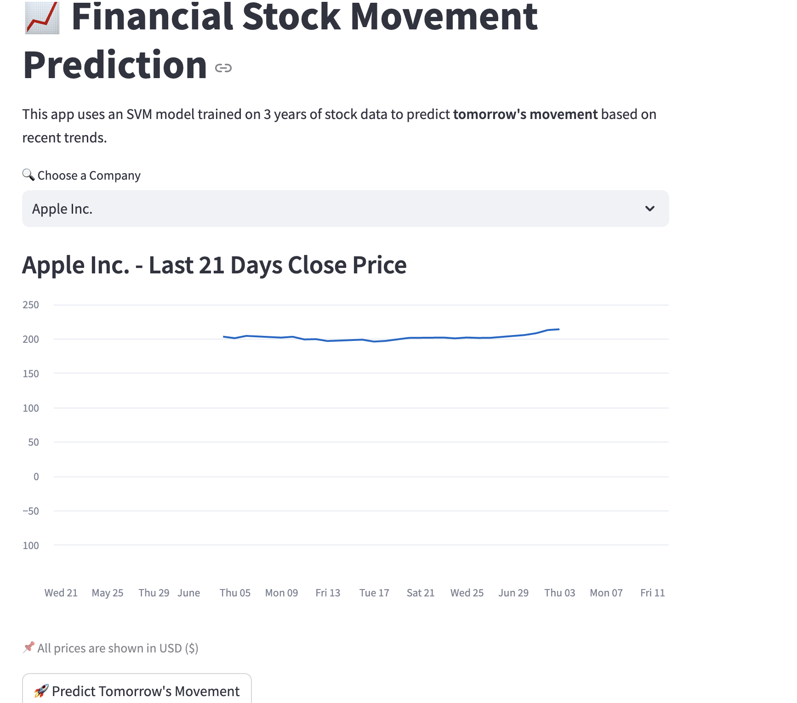
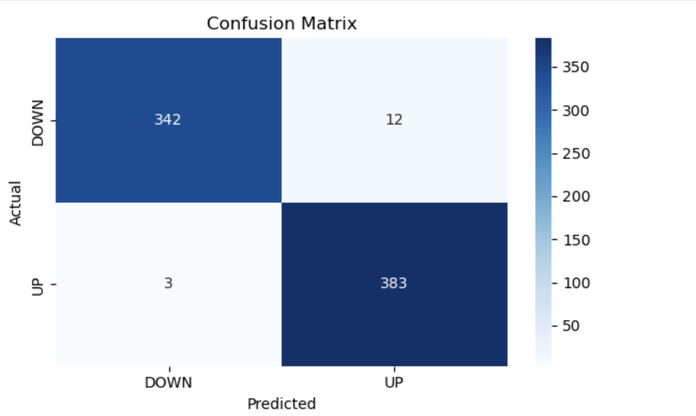

# 📈 Stock Movement Predictor using SVM

This project predicts **next-day stock price movement (UP/DOWN)** using a **Support Vector Machine (SVM)** model trained on 3 years of historical stock data. It uses **technical indicators** as features and provides predictions through a clean **Streamlit web interface**.

---

## 🚀 Demo





---

## 🧠 Project Highlights

- Trained on 3 years of daily historical data for:
  - Apple (AAPL)
  - Microsoft (MSFT)
  - Google (GOOGL)
  - Amazon (AMZN)
  - Tesla (TSLA)
- Features used:
  - Past 3-day returns
  - Short-term & long-term moving averages
  - Momentum (short - long)
  - Volatility (rolling std)
  - Encoded ticker symbol
- Achieved ~99% test accuracy on SVM model
- Real-time prediction using **Yahoo Finance API**
- Built with:
  - Python
  - Scikit-learn
  - Streamlit
  - yfinance

---

## 🛠️ Tech Stack

| Part       | Tech                         |
|------------|------------------------------|
| UI         | Streamlit                    |
| Model      | SVM from scikit-learn        |
| Data       | yfinance (Yahoo Finance API) |
| Feature Engineering | pandas, NumPy       |
| Visuals    | seaborn, matplotlib          |

---

## 📁 Project Structure
```
stock-movement-svm/
├── app.py                   # Streamlit frontend app
├── model.pkl                # Trained SVM model
├── scaler.pkl               # Scaler used during training
├── generate_features.py     # Feature engineering logic
├── requirements.txt         # Dependencies
├── README.md                # Project documentation
├── screenshots/
│   ├── screenshot-ui.png        # UI screenshot
│   └── confusion-matrix.png     # Confusion matrix of model performance

```


## ⚙️ How to Run Locally

### 1. Clone the Repo

```bash
git clone https://github.com/snoorbasha50/stock-movement-svm.git
cd stock-movement-svm/frontend

# Install Requirements
pip install -r ../requirements.txt

# Run the Streamlit App
streamlit run app.py
